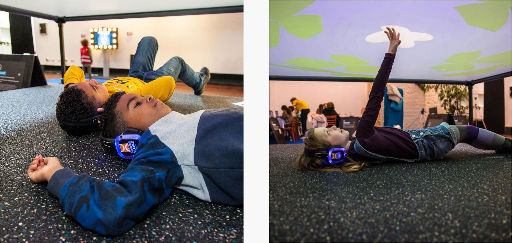

The internet is full of weird videos, but in recent years more and more are appearing dealing with ASMR. Subtle sounds that stimulate the brain. Now, you can combine all these diverse sounds into a single wonderful, strange, unexpectedly pleasant 'audioscape', completely tailored to what you want to hear.

    <video class="kg-card kg-image-card kg-width-wide" src="./pit-a-pat-website-video.mp4" loop autoplay width="1000" heigth="480"></video>

The physical version of pit-a-pat was available to experience during the Cinekid festival 2020. Fortunately, pit-a-pat was also adopted for the web because of the pandamic and is still available to visit at <a href="http://pitapat.org/">pitapat.org</a>.
